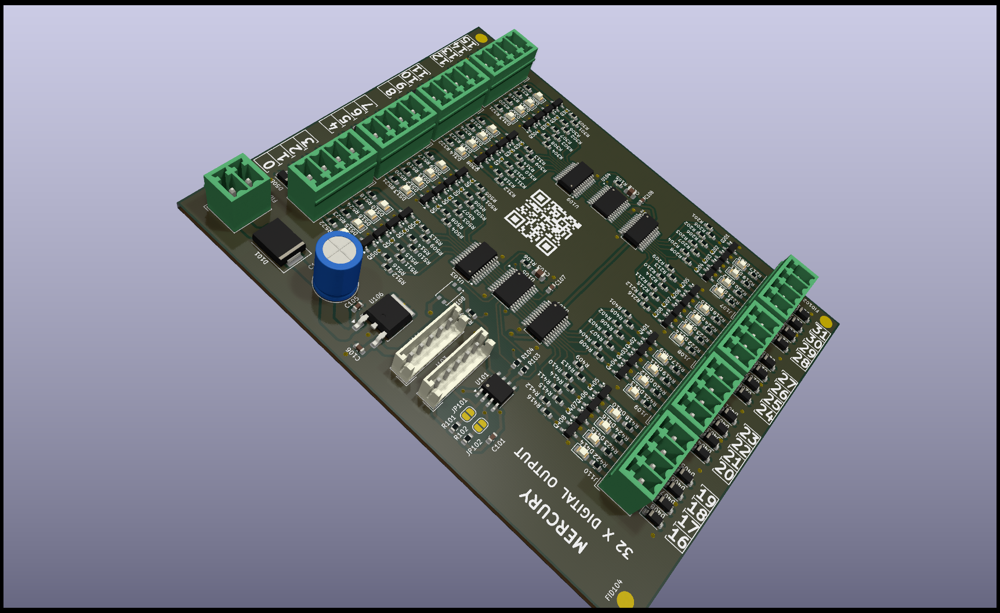

# 32-channel I2C output module.
## General information about the module.

This module is based on two TCA6416A chips.  
* Supply voltage: 24VDC.
* Output voltage: 0V to 24V.
* It has galvanic isolation for I2C signals by ISO1540.
* Each channel has LED indication.
* One TCA6416 module has address 20 and the other has address 21.
* The outputs are based on P-type MOSFETs.
* Output current of each output 0.5A

<a href="https://tranzystorek.pl/" target="_blank">tranzystorek.pl</a>

